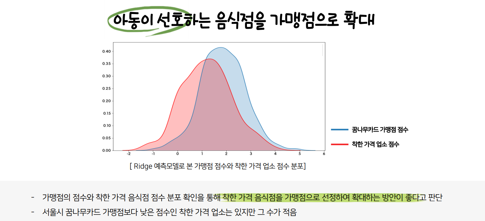

# 2020공공빅데이터청년인턴십 실무형 프로젝트

## 🍱 아동급식카드 가맹점 확대 프로젝트(2020.08.03~2020.08.21)
### 💦 문제점
- 아동급식카드 가맹점이 편의점과 빵집에 치우쳐져있어 이를 해결하고자함.
- 지역별로 1식 단가의 차이가 크고 가맹점의 수도 차이가 크다.
- 다양하지 못한 가맹점 유형과 부족한 가맹점 수가 문제로 뽑혔다.

### 💡 해결방안
- 행정안전부가 실시하는 '착한가격업소'를 아동급식카드 가맹점으로 확대하는 방안을 제안

- 서울시를 기준으로 가맹점 확대 순위를 산정
